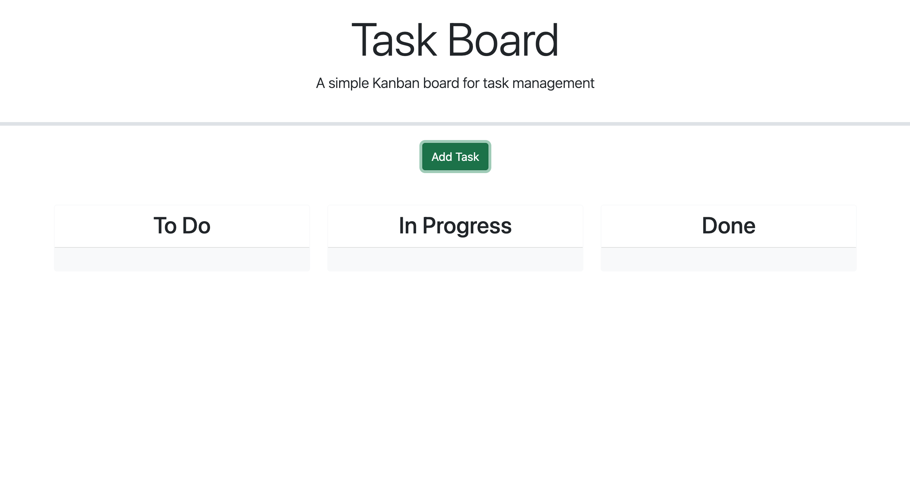

# Task Board

This project was based off starter code provided to me. It is a task tracking system that allows users to manage their tasks using a drag-and-drop interface. Tasks can be organized into different statuses and are stored persistently using localStorage.



**Visit The Deployed Application:** https://breannacamacho.github.io/Task-Board/

## Features

- **Task Creation**: Users can add new tasks with a title, description, and due date.
- **Task Management**: Tasks can be organized into categories such as "To Do", "In Progress", and "Done".
- **Drag and Drop**: Tasks can be easily moved between categories using a drag-and-drop interface.
- **Task Deletion**: Tasks can be deleted from the list.
- **Due Date Highlighting**: Tasks are highlighted based on their due date (e.g., yellow for due today, red for overdue).

## Technologies Used

- **HTML**: Provides the structure and content of the web application.
- **CSS**: Styles the application and ensures a responsive layout.
- **JavaScript**: Implements the core functionality including task management and drag-and-drop operations.
- **Bootstrap**: Enhances the design with pre-built components and styles.
- **jQuery**: Simplifies DOM manipulation and event handling.
- **jQuery UI**: Adds drag-and-drop and date picker functionalities.
- **Day.js**: Handles date manipulations and comparisons.

## Installation

1. Clone the repository:

    ```bash
    git clone https://github.com/breannacamacho/Task-Board.git
    ```

2. Navigate to the project directory:

    ```bash
    cd Task-Board
    ```

3. Open `index.html` in your web browser to use the app.

## Usage

1. Click the "Add Task" button to open the form for adding a new task.
2. Enter the task title, due date, and description in the form.
3. Click the "Add Task" button in the modal to add the task to the board.
4. Drag and drop tasks between the "To Do", "In Progress", and "Done" columns.
5. Click the "Delete" button on a task card to remove it from the board.

## Files

- `index.html`: The main HTML file containing the structure of the application.
- `style.css`: Custom CSS for styling the application.
- `script.js`: JavaScript file implementing the functionality of the application.

## Contributing

Contributions are welcome! To contribute:

1. Fork the repository.
2. Create a new branch: `git checkout -b feature/YourFeature`
3. Commit your changes: `git commit -m 'Add some feature'`
4. Push to the branch: `git push origin feature/YourFeature`
5. Open a pull request.
